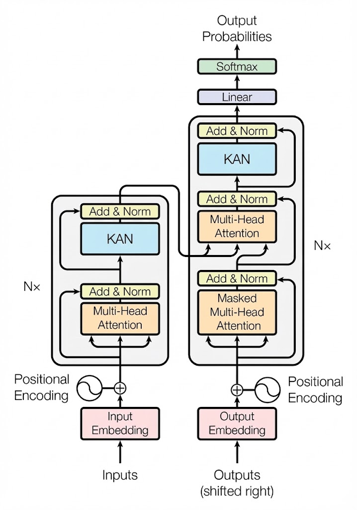
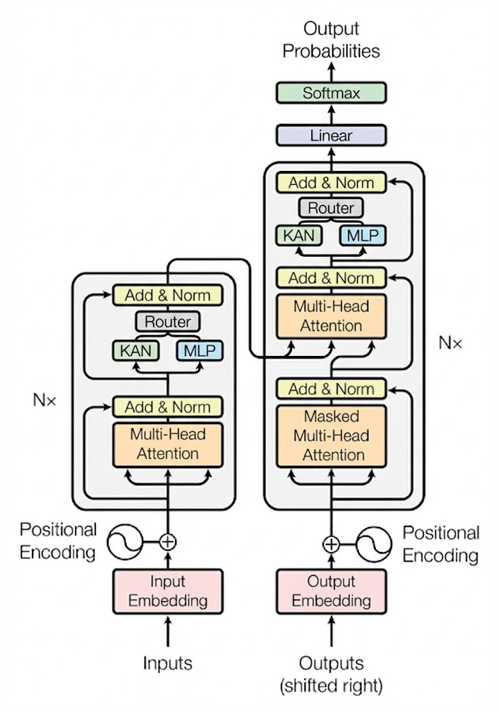

# SwinKAN: Hybridizing MLPs and Kolmogorov–Arnold Networks in Swin Transformers

📄 **Paper**: [Link to Paper](https://drive.google.com/file/d/1a33OUd5lpSNHHrY7Zc6YkS-Ql-8G0RSY/view?usp=sharing) 

---

## 🔍 Overview

Transformers have revolutionized computer vision, yet the dense **Multilayer Perceptron (MLP)** layers inside Transformer blocks remain parameter-heavy and difficult to interpret.  
This project explores **Kolmogorov–Arnold Networks (KANs)** as a structured and interpretable alternative to MLPs within **Swin Transformer** architectures.

We introduce **SwinKAN**, a family of architectures that integrate KANs into the Swin Transformer Feed-Forward Networks (FFNs) using multiple strategies:
- Full replacement
- Partial (hybrid) replacement
- Mixture-of-Experts (MoE) routing

Experiments on medical imaging datasets show that KANs can significantly improve performance in structured and texture-sensitive tasks.

---

## ✨ Key Contributions

- ✅ First systematic study of **KANs inside Swin Transformers**
- ✅ Multiple integration strategies (Full, Hybrid, MoE)
- ✅ Empirical evaluation on **HAM10000** and **Skin Disease** datasets
- ✅ Improved interpretability via learnable univariate edge functions
- ✅ Performance gains in structured medical imaging tasks

---

## 🏗️ Architecture & Methodology

This project modifies the **Feed-Forward Network (FFN)** component inside Swin Transformer blocks.

### 1️⃣ Full KAN Replacement

All MLP layers in Swin Transformer blocks are replaced with KAN layers.

 <!-- TODO: replace with actual GitHub image path -->

**Motivation**
- Leverages the Kolmogorov–Arnold representation theorem
- Uses learnable univariate functions on edges instead of fixed activations

> Best-performing strategy for structured datasets such as HAM10000.

---

### 2️⃣ Hybrid Integration

#### 🔀 Randomized Replacement
A fixed percentage (e.g., 25%, 50%) of Transformer blocks use KANs, while the rest use standard MLPs.

 <!-- TODO: replace with actual GitHub image path -->

#### ⏱️ Early-Layer Replacement
KANs replace MLPs only in the first *k* Transformer blocks, allowing:
- KANs to capture low-level texture patterns
- MLPs to stabilize higher-level semantic features

 <!-- TODO: replace with actual GitHub image path -->

---

### 3️⃣ Mixture of Experts (MoE) Routing

Each FFN is replaced with an MoE module containing:
- 🟦 KAN Expert
- 🟧 MLP Expert

A lightweight routing network dynamically assigns tokens to experts based on their characteristics.

 <!-- TODO: replace with actual GitHub image path -->

**Motivation**
- Adaptivity to diverse feature distributions
- Handles noisy and high-granularity datasets better

---

## 📊 Experiments & Results

### 📁 Dataset 1: HAM10000 (Skin Cancer MNIST)

- **Source**: [Kaggle – HAM10000](https://www.kaggle.com/datasets/kmader/skin-cancer-mnist-ham10000)
- **Task**: 7-class skin lesion classification

**Observation**:  
Full KAN replacement significantly improves performance, indicating better texture modeling.

| Method | Accuracy (%) | F1-Score |
|------|-------------|----------|
| Baseline (MLP) | 81.82 | 0.8187 |
| **Full KAN Replacement** | **86.10** | **0.8611** |
| 50% Random Replacement | 83.11 | 0.8310 |
| 25% Random Replacement | 82.34 | 0.8213 |

---

### 📁 Dataset 2: Skin Disease Dataset

- **Source**: [Kaggle – Skin Disease Dataset](https://www.kaggle.com/datasets/pacificrm/skindiseasedataset)
- **Task**: 22-class fine-grained classification

**Observation**:  
Performance saturates due to high class granularity and noise. Marginal gains motivate adaptive MoE routing.

| Method | Accuracy (%) | F1-Score |
|------|-------------|----------|
| Baseline (MLP) | 80.02 | 0.7999 |
| Full KAN Replacement | 80.66 | 0.8059 |
| 50% Random Replacement | 79.93 | 0.7984 |
| 25% Random Replacement | 79.72 | 0.7981 |

---

